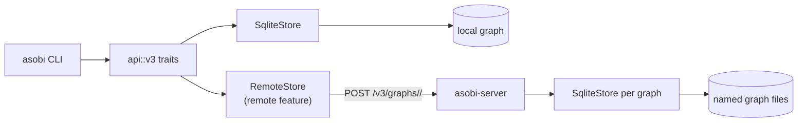

<div align="center">

# 🎮 asobi

**A persistent knowledge-graph CLI for people and agents.**

Keep project knowledge and task state in a local SQLite graph, or share a named graph across devices through `asobi-server`.

[](https://github.com/azusachino/asobi/actions/workflows/ci.yml) [](https://github.com/azusachino/asobi/releases) [](LICENSE) [](https://www.rust-lang.org)

[](https://crates.io/crates/asobi) [](https://crates.io/crates/asobi) [](https://docs.rs/asobi) [](CODE_OF_CONDUCT.md) [](CONTRIBUTING.md)

[](https://github.com/azusachino/asobi/commits/main) [](https://github.com/azusachino/asobi/stargazers)

</div>

---

## ✨ Features

- **Knowledge graph** — entities, append-only (capped) observations, truths, and directed relations; local by default, remote by workspace configuration.
- **Truths** — durable `key→value` facts per entity for current state (`status`, `version`); status-as-truth makes a board a single `search --where status=…`.
- **Fast search** — `search` over SQLite FTS5 (BM25 relevance, porter stemming) with a substring fallback, plus `--where key=value` truth filters (the query term is optional).
- **Task lifecycle** — graph-backed tasks record open work; an open task idle for `abandon_days` (7) becomes `ABANDONED`, and finished tasks are deleted `retention_days` (7) later. Epics with open children are never abandoned.
- **Shared graphs** — `asobi-server` serves named graphs over HTTP; remote CLI mode is optional and outage fallback keeps writes local.
- **Lazy reads** — `graph`/`search` return truths + counts; `show` returns the full body. Cheap to load, cheap on tokens.

## 🏗️ Architecture

The four-crate workspace builds two binaries: `asobi` for local or remote CLI use, and `asobi-server` for hosting named graphs. Both use the async `api::v3`; the SQLite provider is implemented with sqlx. Remote support is an opt-in CLI feature and sends plain JSON over HTTP.



Commands depend only on `api::v3` traits, never on driver types. Only `asobi-storage` owns SQL, migrations, and SQLite settings (ADR 0009). No handshake is used; `GET /healthz` is a liveness probe. Pre-0.8 graph files are refused unchanged and must be moved aside before use with 0.8. See [ADR 0005](docs/decisions/0005-remote-server.md), [ADR 0007](docs/decisions/0007-clean-schema-baseline.md), and [ADR 0008](docs/decisions/0008-async-storage-on-sqlx.md).

## 📦 Installation

### From crates.io (recommended)

```bash
cargo install asobi                      # local-only CLI, no HTTP client
cargo install asobi --features remote   # CLI with remote mode
cargo install asobi-server              # named-graph HTTP server
```

### Prebuilt binaries

Download the platform archive from the [GitHub release](https://github.com/azusachino/asobi/releases) and extract it. It contains both `asobi` (built with remote support) and `asobi-server`.

### Local server container image

Run `make image` to build the native-architecture Podman image
`azusachino.com/asobi-server:v<workspace-version>`. The non-root container
persists graph files under `/data`. See the
[server image guide](docs/usage.md#asobi-server-container-image) for the
liveness probe and the cluster-host-only import target.

### From source

```bash
cargo install --git https://github.com/azusachino/asobi asobi
cargo install --git https://github.com/azusachino/asobi asobi --features remote
```

Or build locally with `make build` (local CLI), `cargo build -p asobi --features remote`, or `cargo build -p asobi-server`. Requires Rust 1.94+, Edition 2024.

### Upgrading from 0.7

0.8 refuses graph files created by earlier versions and leaves them untouched; move an old graph file aside to start a new graph at that path. Nothing is migrated. `asobi skills` and sessions are gone. See the [0.8.0 migration notes](CHANGELOG.md#v080).

## 🚀 Quick Start

```bash
asobi init                  # one-time setup (XDG); use --local for a project-scoped graph

# Store and recall context (names are hierarchical, e.g. ame:mobile-support:task-1)
asobi new "my-project" project --obs "Decided to use WAL mode for concurrency"
asobi obs "my-project" "Readers never block the single writer"
asobi truth "my-project" "status" "in-progress"
asobi search "WAL"
asobi show "my-project" --with-ids
asobi update-obs "my-project" 1 "Decided to use SQLite WAL for concurrency" --id
asobi rm-obs "my-project" 1 --id

```

## 🌐 Shared Graphs (Client/Server)

Run one `asobi-server` and point any number of workspaces, on any number of devices, at a named graph on it.

```bash
# On the server host (its own data directory; never the CLI's)
asobi-server --listen 0.0.0.0:8300 --data-dir /srv/asobi
curl -s -o /dev/null -w '%{http_code}\n' http://<host>:8300/healthz   # 200
```

> [!WARNING]
> `asobi-server` has **no authentication**. Keep it reachable only on a private network such as a tailnet, never on the public internet.

On each client, install the CLI with `--features remote` (or use the prebuilt binary) and configure the workspace's `asobi.toml`:

```toml
remote = "https://asobi.example.ts.net"
graph = "workstation"   # optional; defaults to "asobi"; created on first use
```

`ASOBI_REMOTE` and `ASOBI_GRAPH` override those keys. Every command then works exactly as in local mode, against the server's graph. A workspace is either local or remote as a whole.

If the server cannot be reached on a command's first call (connection failure, a two-second timeout, or a gateway 502/503/504), the command warns on stderr and uses the local graph instead. Those writes stay local and are never merged into the server later. A URL that does not serve the Asobi API fails with `server does not speak API v3` rather than falling back. See [remote workspaces](docs/usage.md#remote-workspaces) and [ADR 0005](docs/decisions/0005-remote-server.md).

## 💻 Common Commands

- `asobi graph` / `search <q>` / `search --where status=READY` / `show <name>... --expand part_of --with-ids` — read the graph (supports subtree expansions and sequential observation IDs).
- `asobi new <name> <type> --obs "..."` / `obs <name> "..."` / `update-obs <name> <old/id> <new> [--id]` / `rm-obs <name> <content/id> [--id]` — manage observations (supports updates and deletions by unique sequential IDs).
- `asobi truth <name> <key> <value>` / `rm-truth <name> <key>` — manage truths. A truth is the current value and nothing else: an overwrite replaces it, with no archive behind it.
- `asobi tasks plan <epic> --objective "..." --task "..."` / `tasks list` / `tasks dispatch --agent <name>` / `tasks sync <task> --status DONE --note "..."` / `tasks close <epic>` — plan and coordinate work; status is a truth, notes are observations.
- `asobi stats` / `purge` / `reset` — inspect & manage. In local mode the graph is one SQLite file, so `cp` it to back it up; remote graphs are backed up on the server.

## 🔒 Sandboxed Environments

When running in sandboxed or restricted environments (such as Codex, Nix build sandboxes, or containerized runners), use a project-local workspace (`asobi init --local`) or configure custom database paths (`ASOBI_HOME`, `ASOBI_DATABASE_URL`). The storage backend runs SQLite in WAL mode; `ASOBI_BUSY_TIMEOUT` (milliseconds, 15 s by default) bounds how long a write waits for the lock.

See the [Running in Sandboxed Environments](docs/usage.md#running-in-sandboxed-environments-codex-etc) section in the Usage Guide for more details.

## 🛠️ Development

- **Toolchain**: `mise install` (or `make init`) provisions the pinned Rust, uv, bun, and ruff from `.mise.toml`. CI and release builds read the same file, so local and CI resolve identical versions.
- **Task runner**: `make`. `make check` is the quality gate: rustfmt, Prettier, Ruff, Clippy with `-D warnings`, Rust tests, storage-boundary checks, and CLI verification.
- **Rust quality standard**: keep code rustfmt-clean, introduce no Clippy warnings, preserve single-threaded test isolation, and add regression coverage for behavior changes. Run `make check` before commits.
- **Coverage**: with `cargo-tarpaulin` installed, run `cargo tarpaulin --out Html --output-dir coverage` and open `coverage/index.html`.
- **Benchmarks**: run `make bench`; use [performance profiling](docs/benchmarks/profiling.md) for Criterion baselines, DHAT allocations, and SQL plans.
- See [`docs/usage.md`](docs/usage.md) for the full CLI reference and [`docs/architecture.md`](docs/architecture.md) for design. The narrative walkthrough of _why_ the command set is shaped this way — the lazy-read contract, truths versus observations, the dispatcher as a convention — moved to [harus-kb](https://github.com/azusachino/harus-workstation/blob/main/docs/projects/asobi/workflow.md). Agent workflow guidance lives in this repository's [`asobi` skill](skills/asobi/SKILL.md). Install it with `npx skills add https://github.com/azusachino/asobi --skill asobi --agent universal`; Asobi itself does not install skills.
