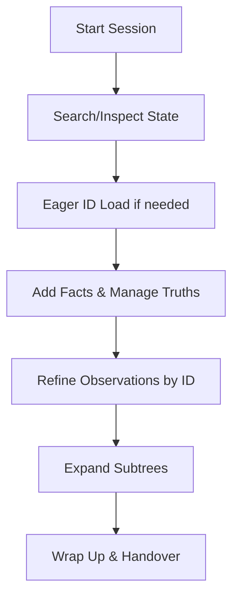
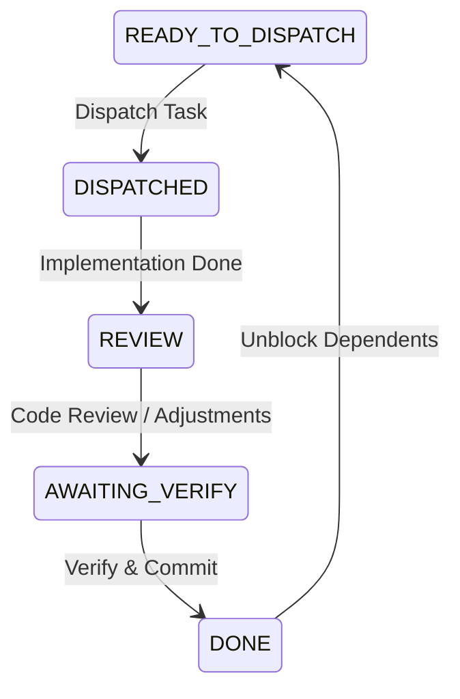

# Asobi: Day-to-Day Developer & Agent Workflow

Asobi is built around a **terse CLI design** and a **lazy-read contract** to serve as the ultimate project memory for LLM agents. Every command is optimized to prevent token bloat, execute in <10ms, and maintain strict data precision.

This guide walks through a typical day-to-day workflow of a developer or agent using Asobi and explains the under-the-hood efficiency of each command.

---

## The Core Concept: The Lazy-Read Contract

To achieve maximum **token efficiency**, Asobi splits graph reading into two modes:
1. **Lazy Reads (`search` / `graph`)**: Return only metadata, entity types, truths, and observation *counts*. They completely omit long raw observation logs and skill bodies.
2. **Eager Detailed Reads (`show`)**: Load raw observation logs, but only for the specific entities requested.

By defaulting to lazy reads, agents avoid ingestion of hundreds of historical text lines unless they explicitly need to inspect or modify them.

---

## Day-to-Day Workflow



### Phase 1: Session Initiation (Start of Day)

When an agent wakes up or a developer resumes a task, they need to load the project's current status.

#### Step 1: Find active tasks (Lazy Search)
```bash
asobi search --where status=IN_PROGRESS
```
* **Why it works**: Queries the `asobi_truths` table for entities matching the status key.
* **Token Efficiency**: Returns a compact JSON payload containing only matched entity names, their types, and the count of observations. **No raw logs are loaded.**
* **Database Efficiency**: SQLite queries are backed by an index on `(entity_name, key, value)`, resulting in an instantaneous $O(1)$ search.

#### Step 2: Load details for the target task (Eager ID Load)
```bash
asobi show my-project:session --with-ids
```
* **Why it works**: Eagerly loads all observations under `my-project:session`.
* **Token Efficiency**: By passing `--with-ids`, Asobi returns each observation paired with its autoincremented integer ID (e.g. `{"id": 42, "content": "next: refactor db"}`). Since timestamps (`createdAt`) are excluded, it strips out 20-30 characters per observation, saving valuable context tokens.

---

### Phase 2: routine Development & Fact Capture (Mid-Day)

As you work, decisions are made, dependencies are discovered, and state changes.

#### Step 3: Append new observations
```bash
asobi obs my-project "Decided to switch to libSQL for concurrent WAL support"
```
* **Why it works**: Appends a new observation to `my-project`.
* **Token/DB Efficiency**: Performs a clean SQL `INSERT` statement. Observations are automatically capped to the project-local limit (default 200) using a trigger/eviction query, preventing the graph database from growing indefinitely.

#### Step 4: Record current truths (Facts)
```bash
asobi truth my-project "status" "IN_PROGRESS"
asobi truth my-project "version" "0.3.0"
```
* **Why it works**: Inserts or updates the single-source-of-truth facts for `my-project`.
* **Token/DB Efficiency**: Truths represent the current *state*, while observations represent the *history*. Keeping status in truths allows fast, token-cheap reads.

---

### Phase 3: Observation Refinement (Precision Management)

If a task completes or a decision changes, the agent must clean up or refine old observations.

#### Step 5: Update a specific observation by ID
```bash
asobi update-obs my-project 12 "status: BLOCKED on open PR #18" --id
```
* **Why it works**: Atomically replaces observation `12` with the new content text.
* **Token Efficiency**: Instead of sending the full old text string (which might be 100+ tokens) to match, the agent sends a single integer `12` (1 token), saving **99% of argument token overhead**.
* **DB Efficiency**: SQLite performs an $O(1)$ B-tree index lookup using the primary key `id`, completely avoiding costly string scanning on the `content` column.

#### Step 6: Delete a stale observation by ID
```bash
asobi rm-obs my-project 13 --id
```
* **Why it works**: Deletes observation `13` from `my-project`.
* **Token Efficiency**: Like updates, deleting by integer ID reduces the deletion command payload to a single token.

---

### Phase 4: Multi-Hop Knowledge Expansion

When inspecting complex tasks, you often need to check related entities (e.g., all tasks linked to a parent task).

#### Step 7: Subtree show with relation expansion
```bash
asobi show my-project:session --expand part_of --expand depends_on
```
* **Why it works**: Recursively traverses `asobi_relations` starting from `my-project:session` for `part_of` and `depends_on` types, and outputs the combined subgraph.
* **Token/Execution Efficiency**: Consolidates what would have been multiple round-trip commands (e.g., `show`, finding relations, running `show` again on targets) into a **single command execution**. This saves shell process fork latency and collapses token count.

---

### Phase 5: Session End & Handoff (End of Day)

At the end of a session, wrap up the current state so the next agent/developer can seamlessly inherit the context.

#### Step 8: Update volatile session status
```bash
asobi truth my-project:session "status" "READY_TO_DISPATCH"
asobi obs my-project:session "next: run tests on target host"
```

#### Step 9: Sync and index durable knowledge
```bash
asobi compact
```
* **Why it works**: Rewrites stable knowledge entities to project Markdown documents and refreshes the FTS5/vector indices.
* **Token Efficiency**: Volatile entities (`session`, `task`) are excluded from compaction, preventing vector database churn and keeping search results focused on long-term knowledge.

---

## The Task Dispatcher Role (Cross-Agent Coordination)

For multi-agent workflows (where a lead agent dispatches tasks to autonomous sub-agents), Asobi acts as a **durable task dispatcher** that replaces ephemeral in-conversation todo lists or local JSONL files.

Agents coordinate state transitions directly through the graph:
1. **Epic Entity**: Holds the overall objective and scope.
2. **Task Entities**: Hold discrete dispatchable units, linked to the Epic via `part_of` relations.
3. **Task Status (Truth)**: Current status is stored as a truth value (e.g. `status = READY_TO_DISPATCH`).
4. **Task Audit Trail (Observations)**: Implementation notes, PRs, and reviews are appended as observations.



### Day-to-Day Task Dispatcher API Actions:

* **Planning (`tasks plan <epic>`)**:
  Creates the Epic task and its children, linking them via `part_of` relations.
  ```bash
  asobi new "project-x:epic-1" "task"
  asobi truth "project-x:epic-1" objective "Implement FTS5 indexing"
  
  asobi new "project-x:epic-1:task-1" "task"
  asobi truth "project-x:epic-1:task-1" title "Create FTS5 trigger migrations"
  asobi truth "project-x:epic-1:task-1" status "READY_TO_DISPATCH"
  asobi link "project-x:epic-1:task-1" "project-x:epic-1" "part_of"
  ```
  *Efficiency*: Because task statuses are stored as truths, a quick lazy search (`asobi search "epic-1"`) renders the entire task board instantly without loading raw observation bodies.

* **Dispatching (`tasks dispatch <task>`)**:
  Marks the task as `DISPATCHED` and assigns it to a sub-agent.
  ```bash
  asobi truth "project-x:epic-1:task-1" status "DISPATCHED"
  asobi obs "project-x:epic-1:task-1" "dispatched to haiku-developer on 2026-07-01"
  ```
  *Efficiency*: The sub-agent is briefed using `asobi show "project-x:epic-1:task-1" --with-ids` to receive the exact task specs, plans, and warnings in a single read.

* **Reviewing (`tasks sync <task>`)**:
  When the sub-agent completes work, they write their implementation notes into the task's observations and flip status to `REVIEW`:
  ```bash
  asobi obs "project-x:epic-1:task-1" "impl: added FTS5 migration to db.rs; make check passes"
  asobi truth "project-x:epic-1:task-1" status "REVIEW"
  ```
  The lead reviews the diff, leaves a review comment, and marks the task `DONE`:
  ```bash
  asobi obs "project-x:epic-1:task-1" "TL-review: verified migration logic; merged"
  asobi truth "project-x:epic-1:task-1" status "DONE"
  ```

* **Closing (`tasks close <epic>`)**:
  Once all tasks are `DONE`, durable lessons are promoted to the main project entity, and the epic is marked `DONE`:
  ```bash
  asobi obs "project-x" "Convention: Always use sequential IDs for observation tables"
  asobi truth "project-x:epic-1" status "DONE"
  ```
